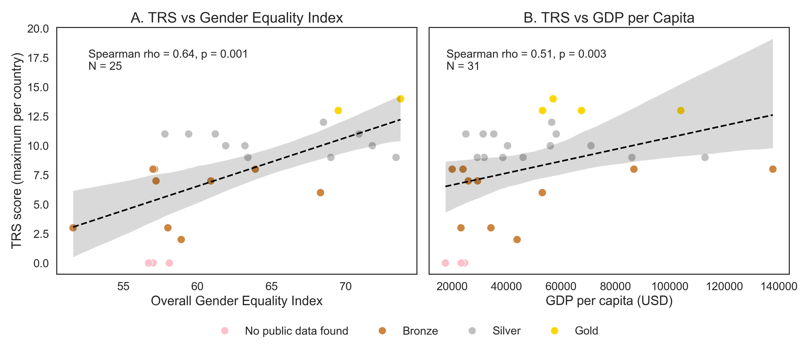

# funders_project
Code accompanying the paper "Girls just wanna have funds: A new Transparent Reporting Scale for evaluating grant data reporting from funding agencies". 



# 1. Clone the repository
```
git clone git@github.com:WomenInNeuroscience/funders_project.git
cd funders_project
```

# 2. Create a Python virtual environment
`python -m venv venv`
## macOS/Linux
`source venv/bin/activate`
## Windows
`venv\Scripts\activate`

# 3. Install dependencies
`pip install -r requirements.txt`

# 4. Generate figures. Launch Jupyter and open the notebook:
`jupyter notebook code/funder_analysis.ipynb`

# 5. Use the interactive app to generate a score for a funder
Go to `https://www.winrepo.org/transparency_calculator/`


